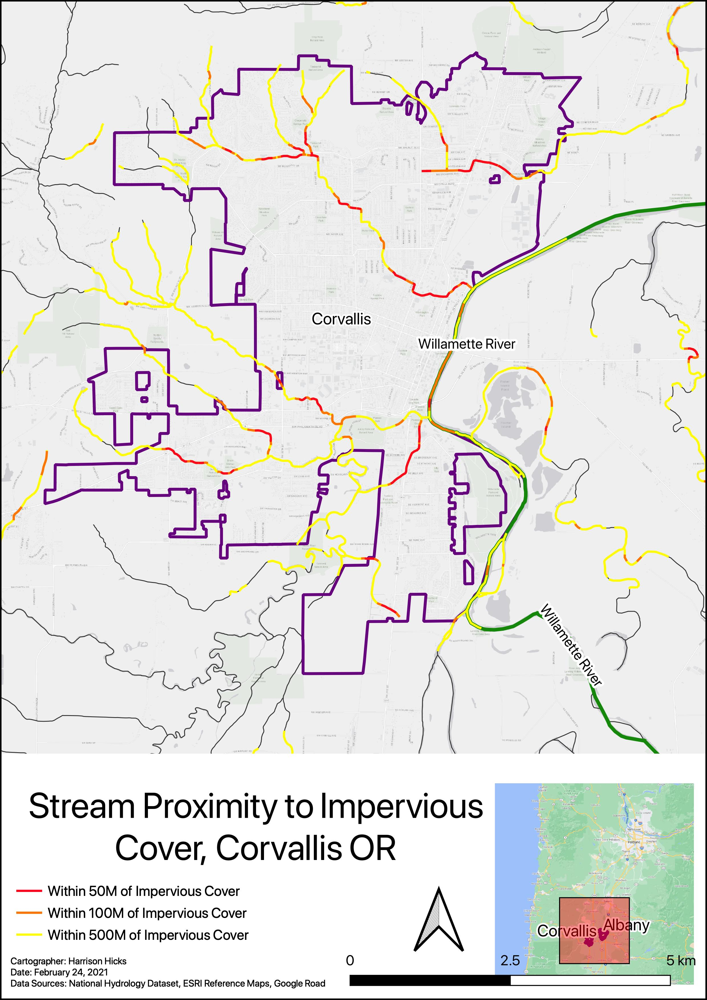

This project represents what a portfolio for a mock client could look like. For the purpose of the exercise, I was 'hired' to create a collection of maps to help aid a non-profit group advocating for water quality. These maps can be used in presentations to help the activists better convery their qualitative information.

 