## Lima

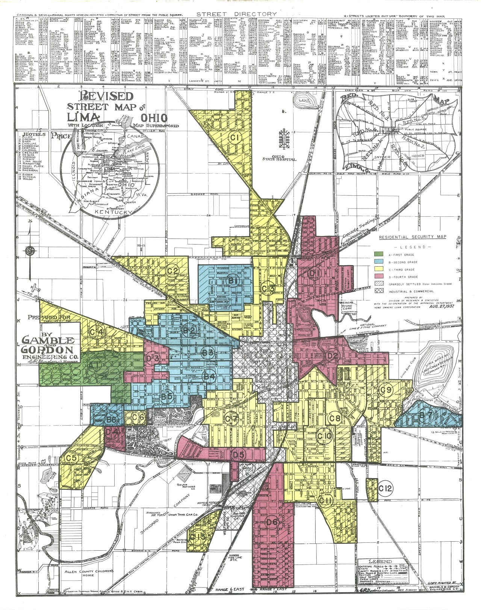
1930s Ohio Redlined Districts

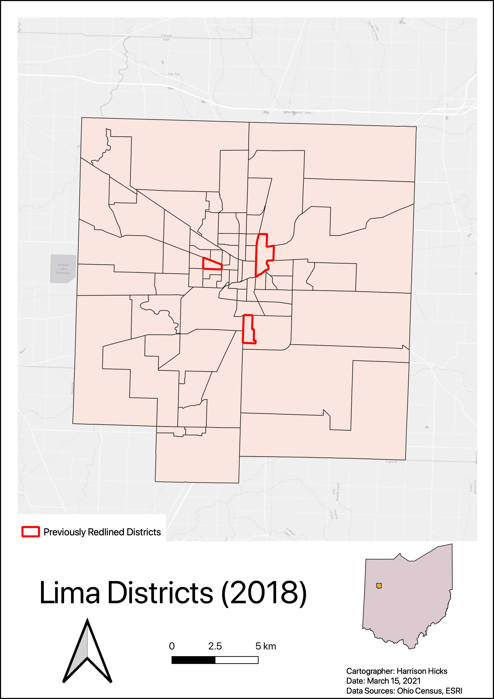

In the 1930s, neighborhoods were given a specific grade that would determine their accessibility to certain opportunities. These ratings were often extremely biased and racist and led to many communities of color having unequal benefits and opportunities. Throughout this project, the previously redlined neighborhoods will be compared to current census data to see if obvious inequalities still exist.

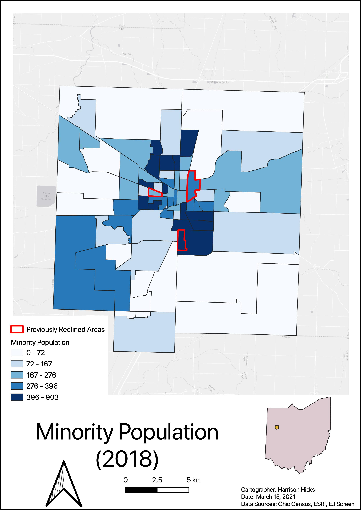

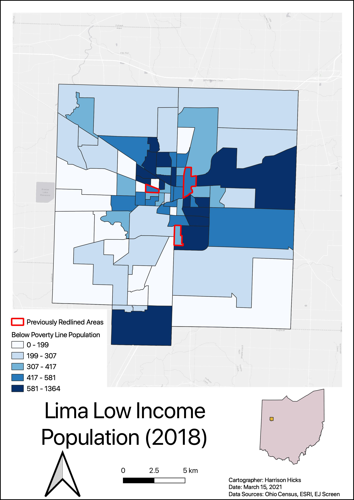

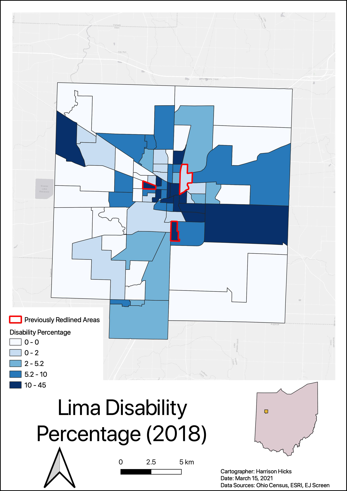

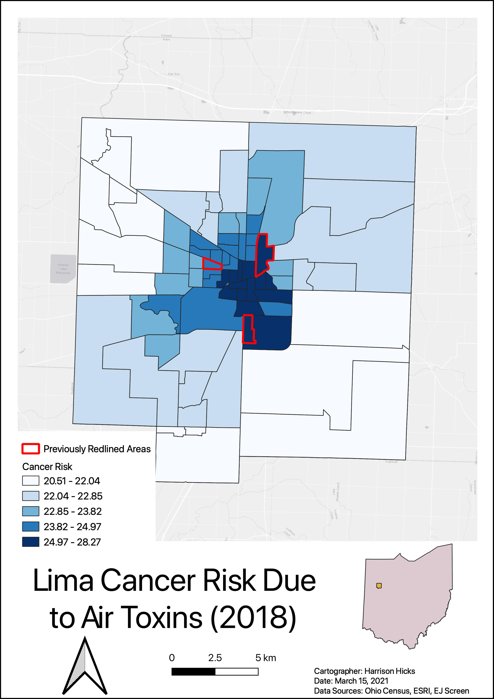

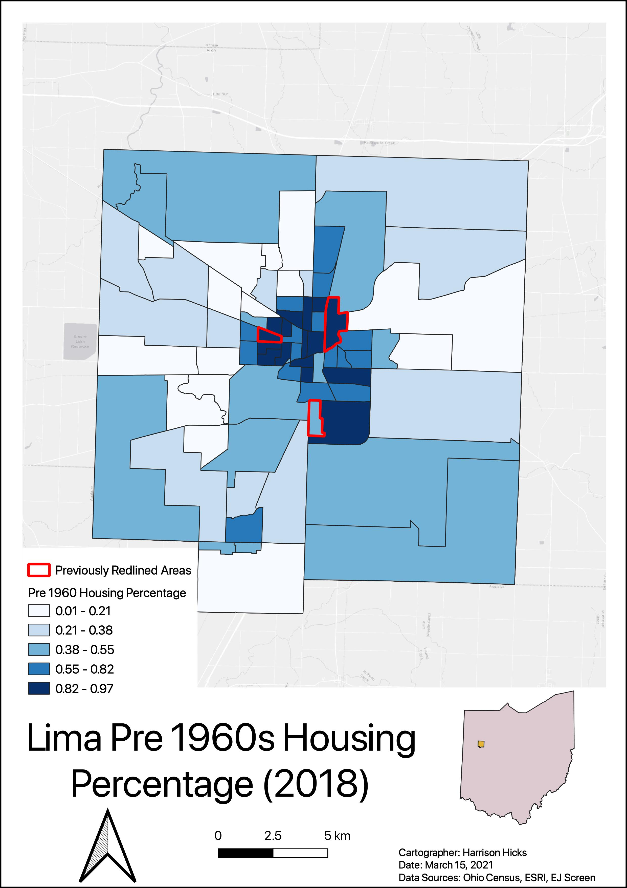

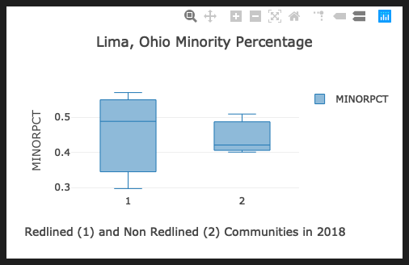

This box-plot helps to highlight the minority percentage differences that still exist between previously redlined neighborhoods and the current communities.

## Springfield

To continue with the study of redlining in Ohio cities, the city of Springfield will be studied. This town, similar to Lima, has a number of redlined districts seen here in this 1934 map. This section will, again, display the current status of these previously redlined districts in relation to a number of variables.

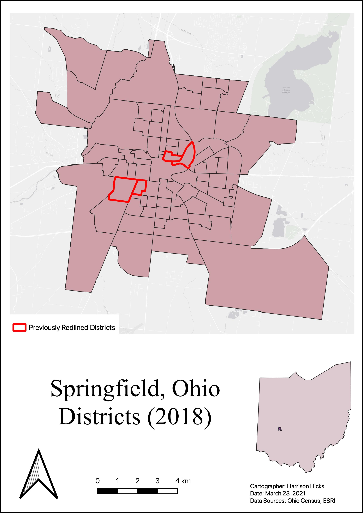

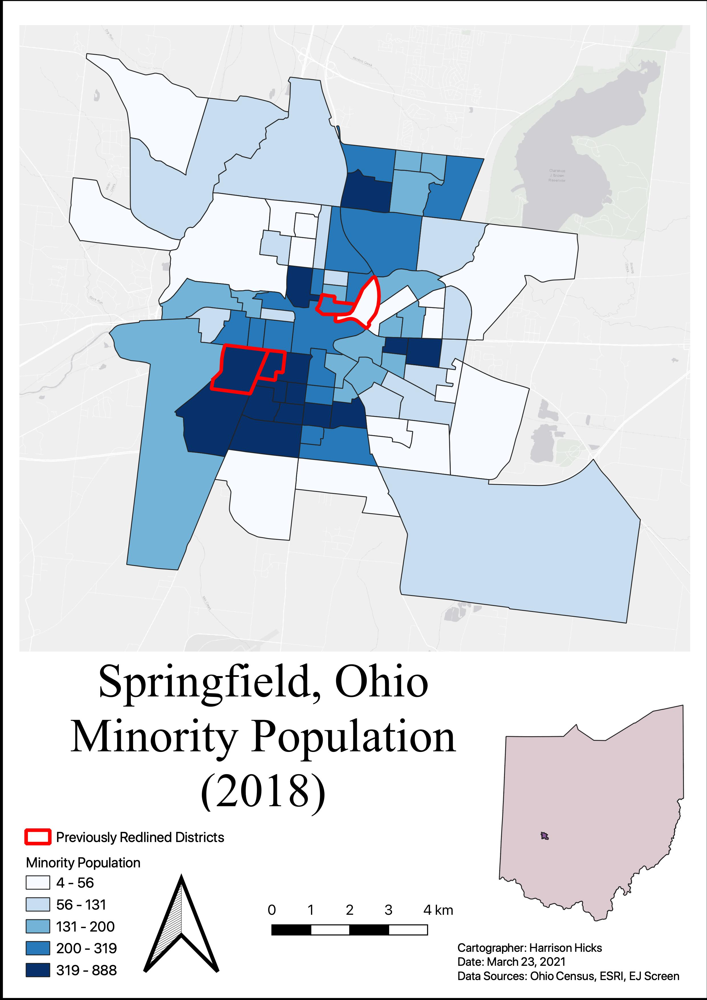

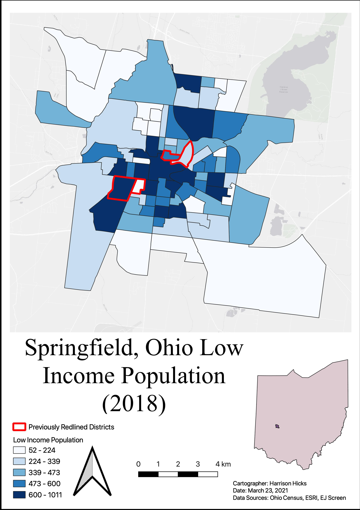

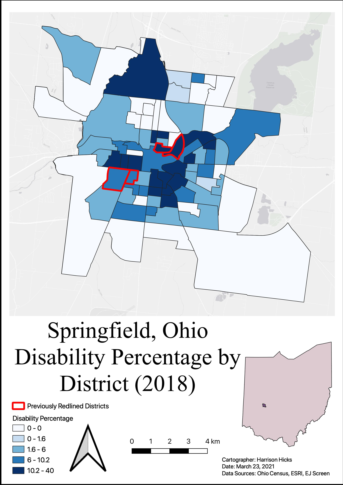

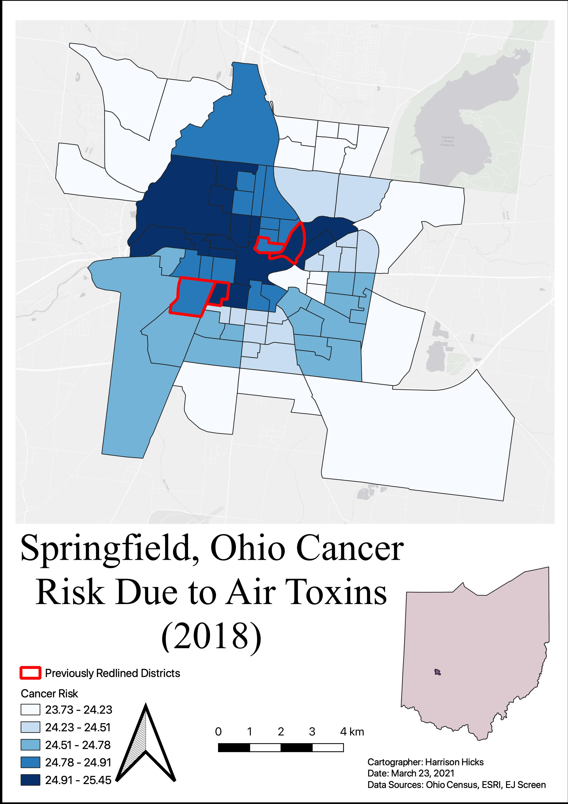

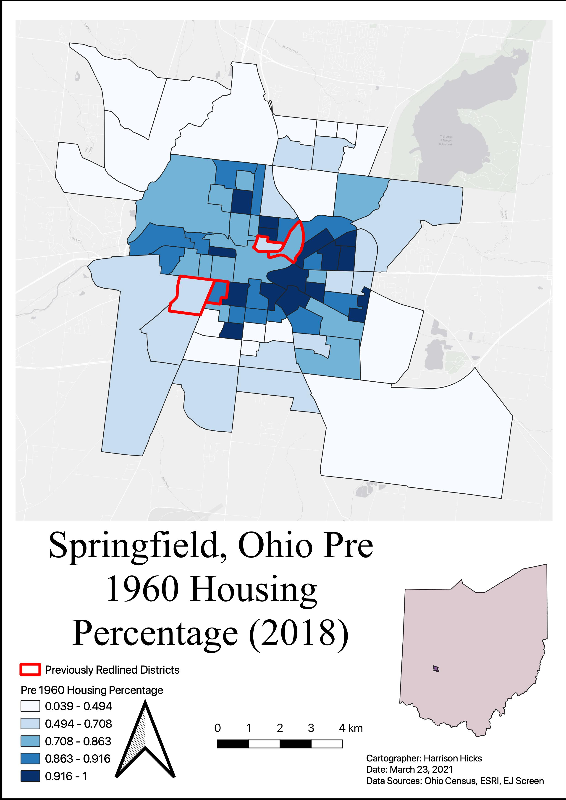

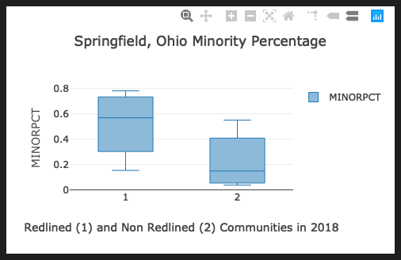

These graphs and maps help to show that in many instances, the lasting impacts of Redlining still exist. Although the boarder may not be as clear cut, this information helps to show how damaging this practice was and how many variables still reflect the racist and harsh practice.
