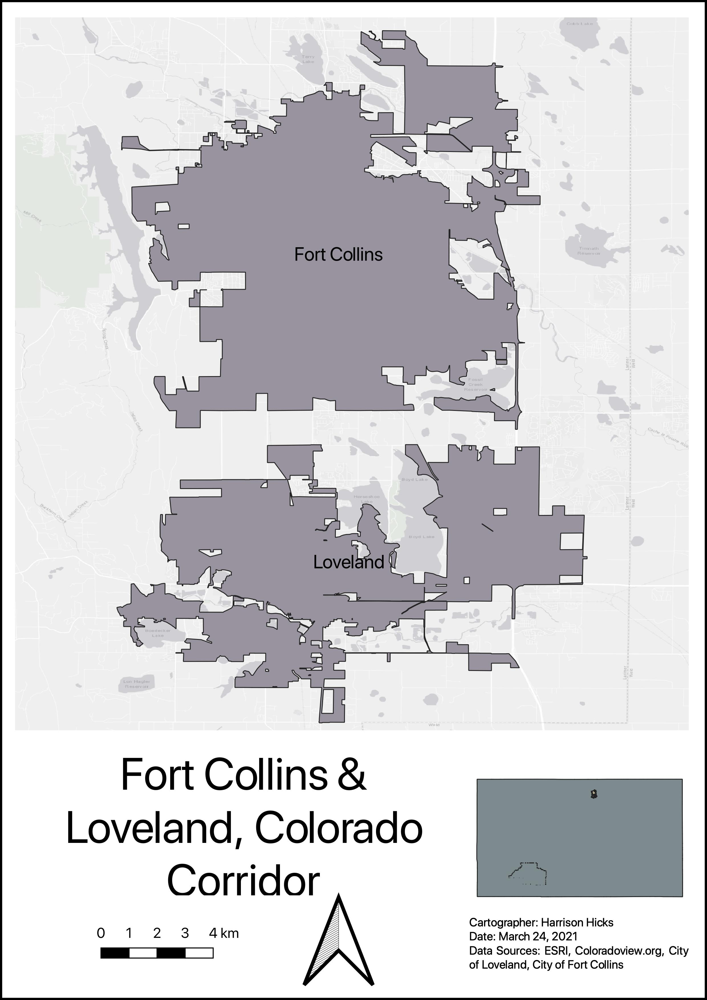
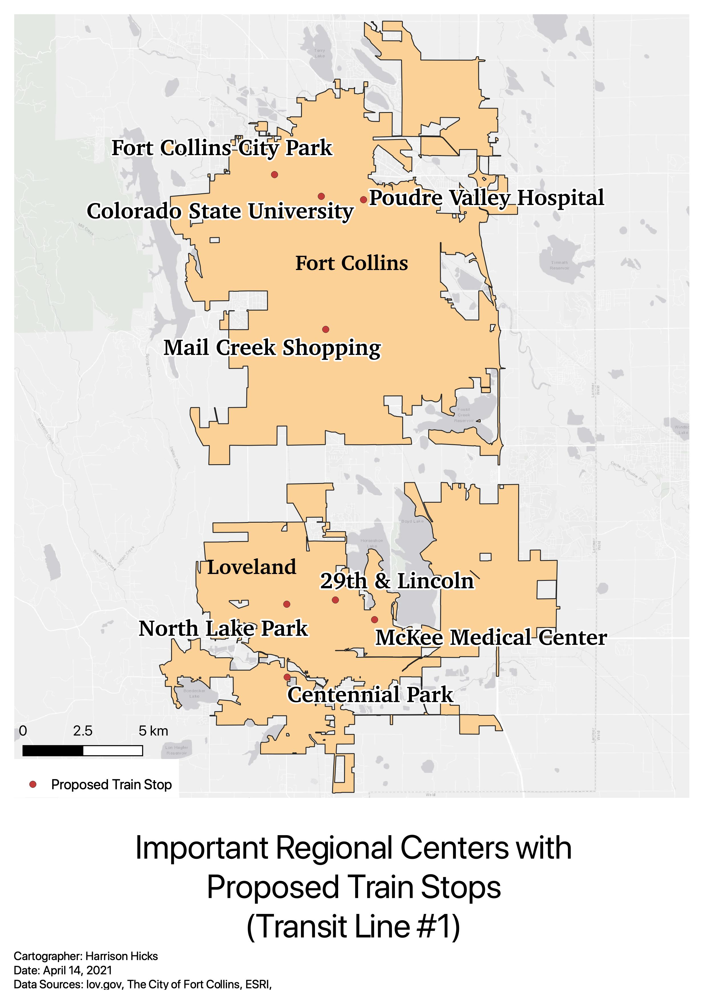
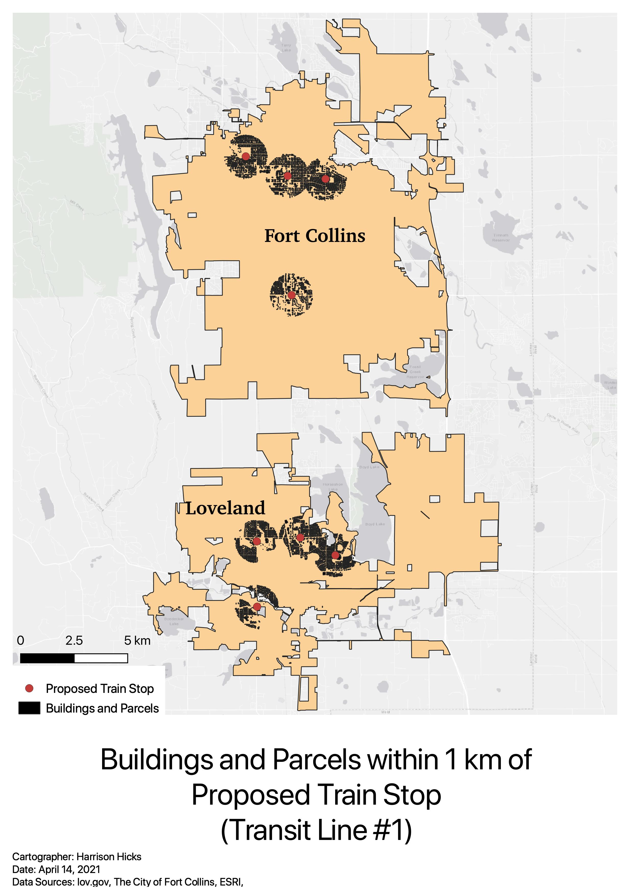
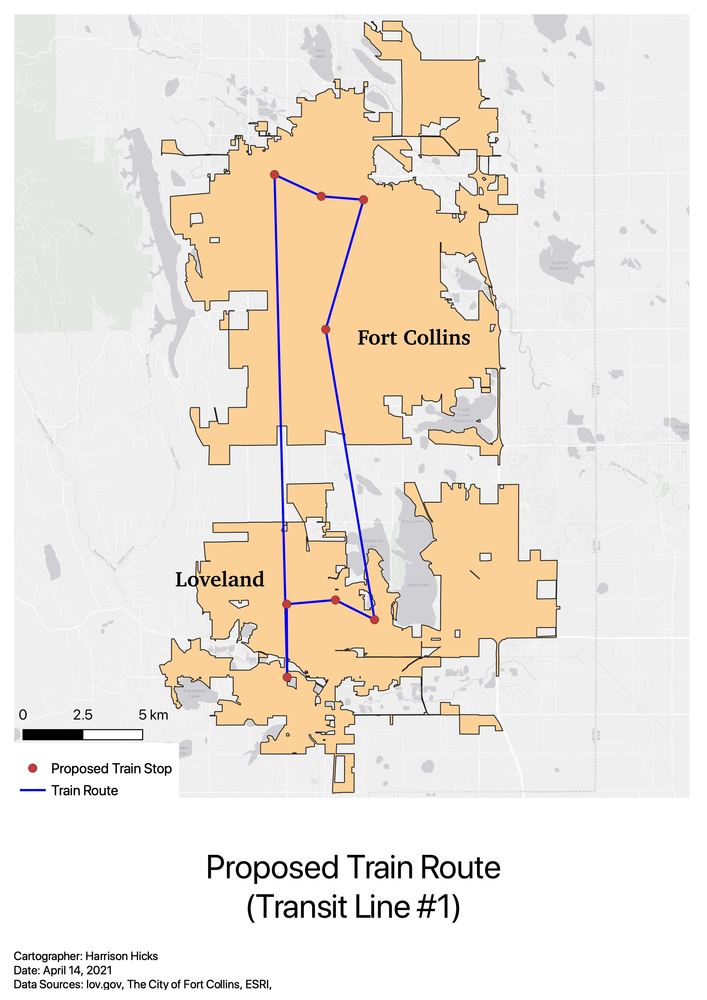
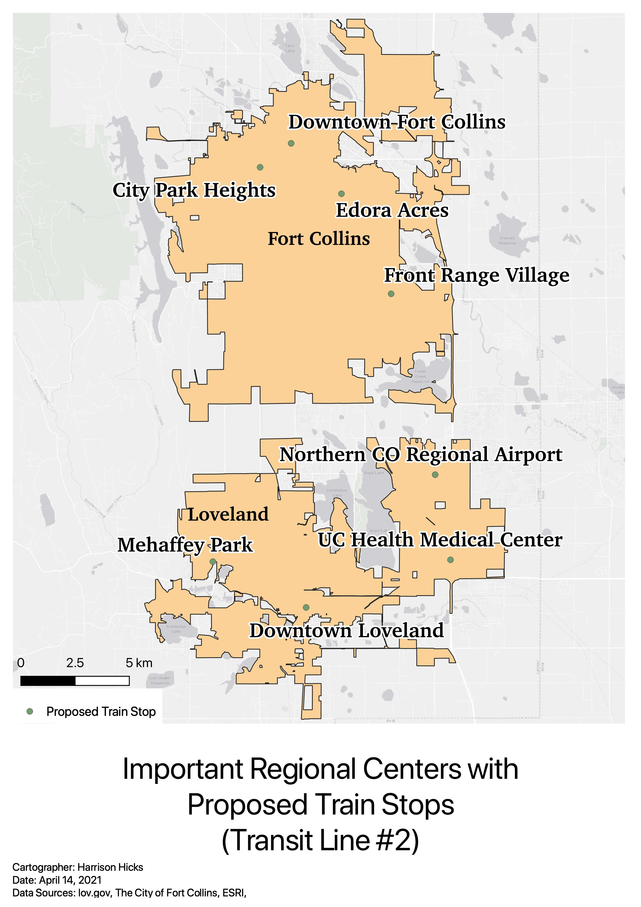
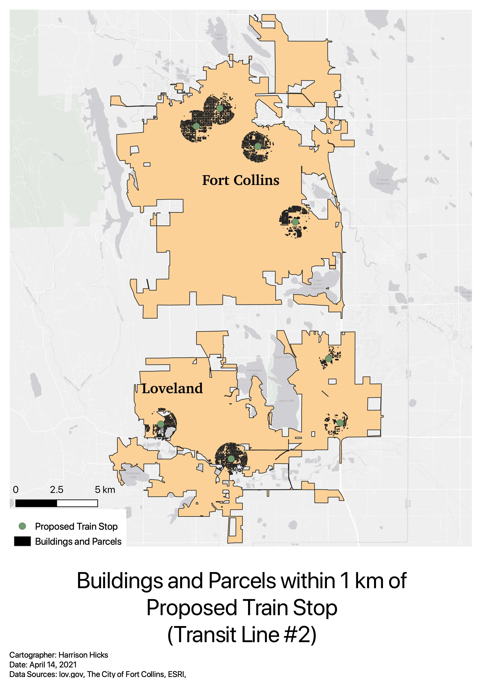
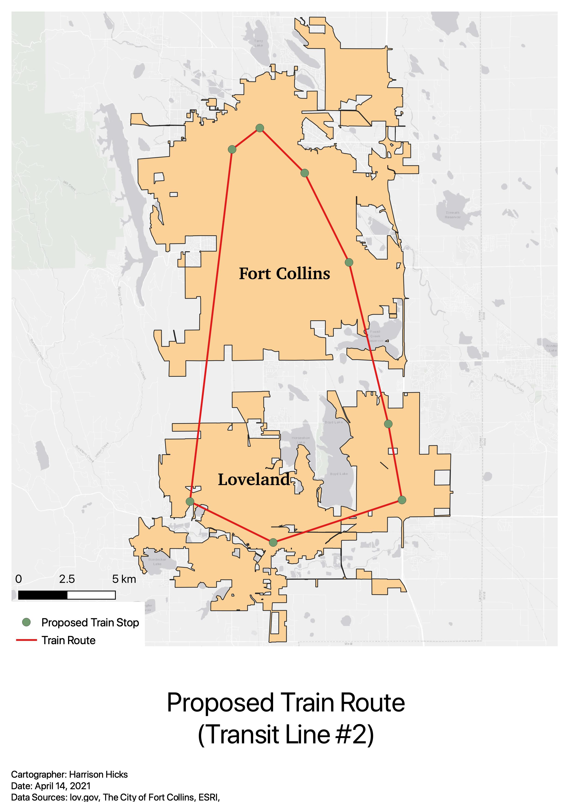

With growing populations in Fort Collins and Loveland, CO, transit expansion will soon be required. For this project, I proposed a new 50km rail line that will connect the two cities. I have proposed two different systems, each of which have their transit stops located near important regional centers.

## Transit Line #1

This map shows a selection of important regional centers where future transit stops will be located.

To help visualize accessibility, this map highlights the buildings and parcels that will be within 1km (10 minutes walk) of each transit stop.

Finally, this map shows the route of the proposed Transit Line #1.

## Transit Line #2

This second proposal selects a new set of important regional centers. This route is slightly longer than Transit Line #1, but it contains an extra stop along its route to provide transit access to more people.

Similar to the first proposal, this second map highlights the buildings and parcels within 1km of each proposed transit stop.

Lastly, this map shows the route of Transit Line #2
