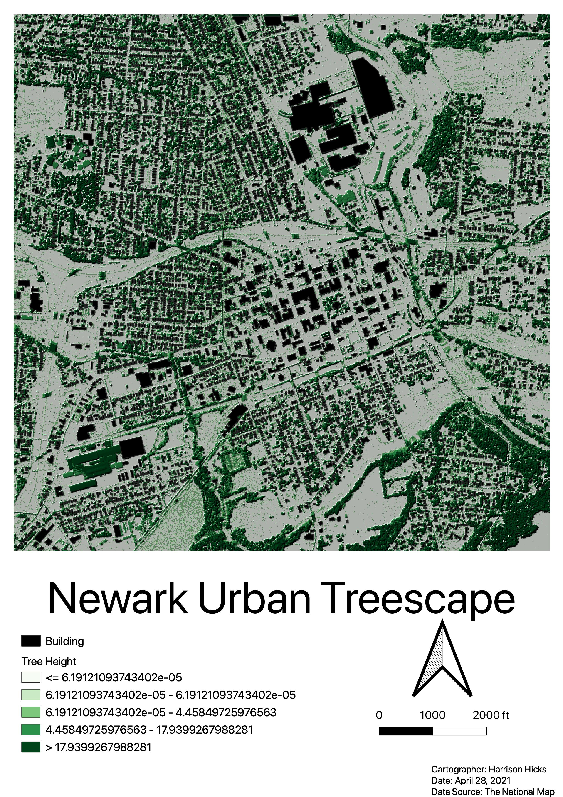
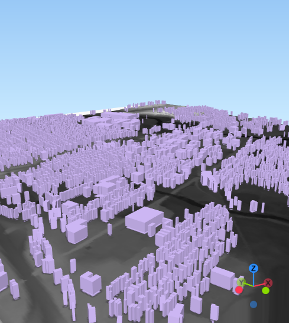
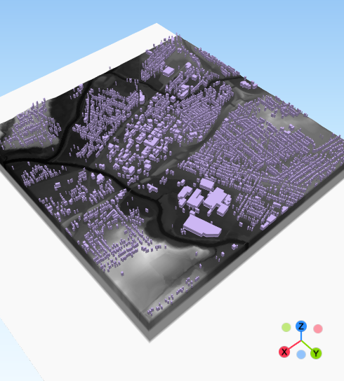
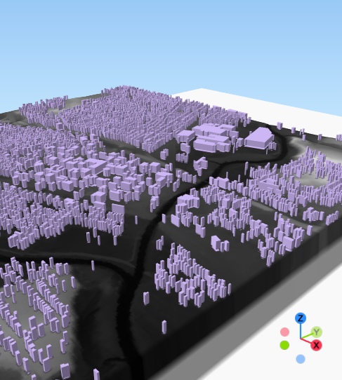

### Fort Hill Analysis

The first section of the project show 3D images of Fort Hill, Ohio. The first image shows the Digital Surface Model (DSM) while the second shows the Digital Terrain Model (DTM).

Next, a hillshade layer was created to help better visualize the terrain. For reference, an outline of the Fort Hill Earthworks was included.

The two figures below use a graphical approach to display the height of Fort Hill. The first image shows a profile graph reading from the NW corner to the SE corner of the Fort Hill Park. The second image reads from the SW corner to the NE corner of the Fort Hill Park.

Next, to help visualize the Fort Hill canopy height, a hillshade image and a raster histogram were created.

Lastly, this image shows the tallest Fort Hill Earthworks trees as well as gaps in the canopy cover.

### Newark Analysis

For the second half of this project, Newark Ohio's landscape will be visualized. The first image shows the buildings and trees in the area.

Secondly, the Qgis2threejs plugin will be used again to help visualize the landscape in a 3D rendering. The images below are screenshots.

