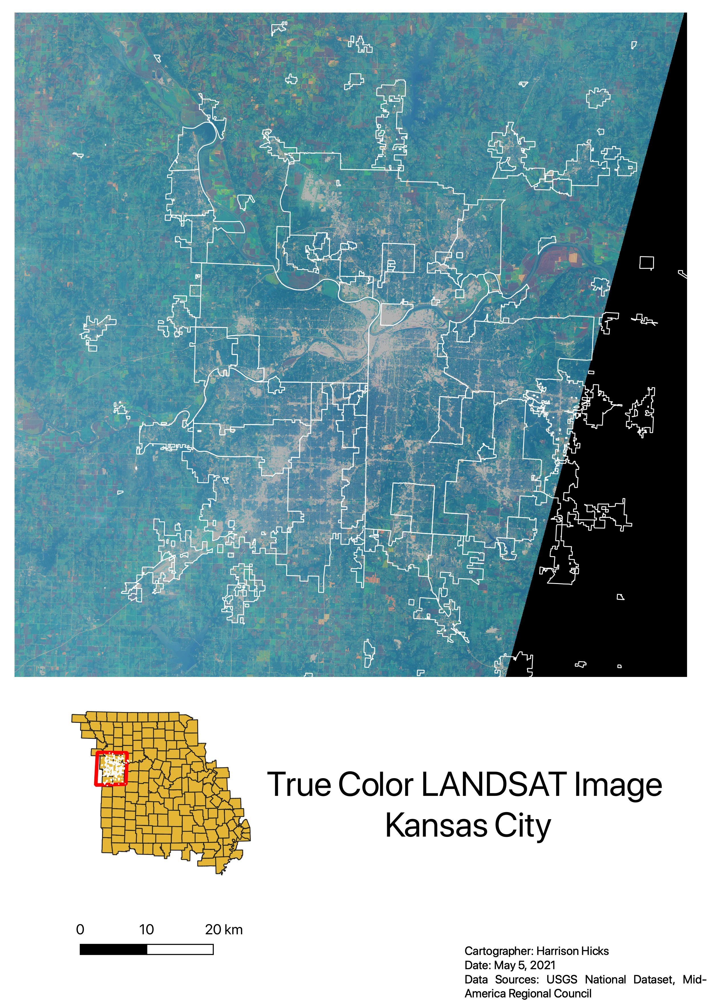
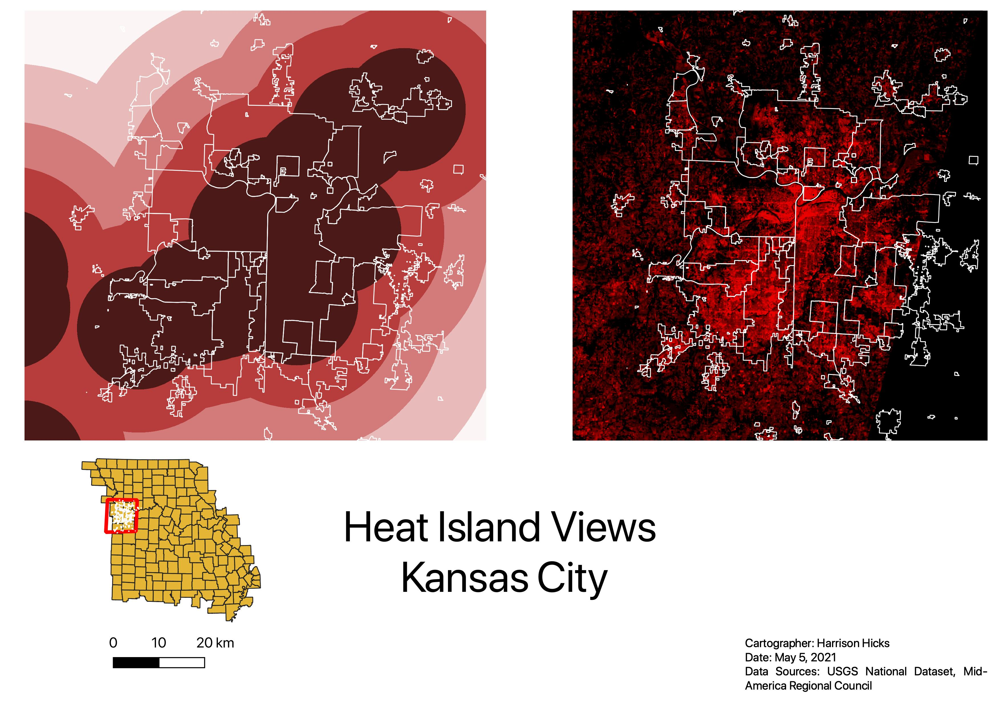
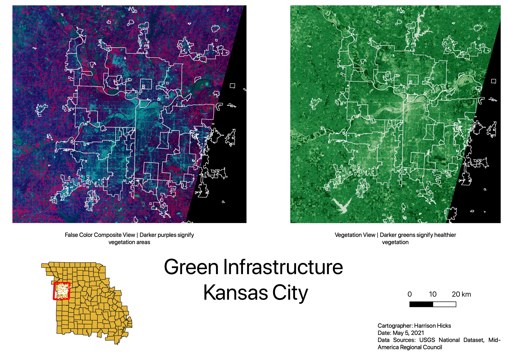
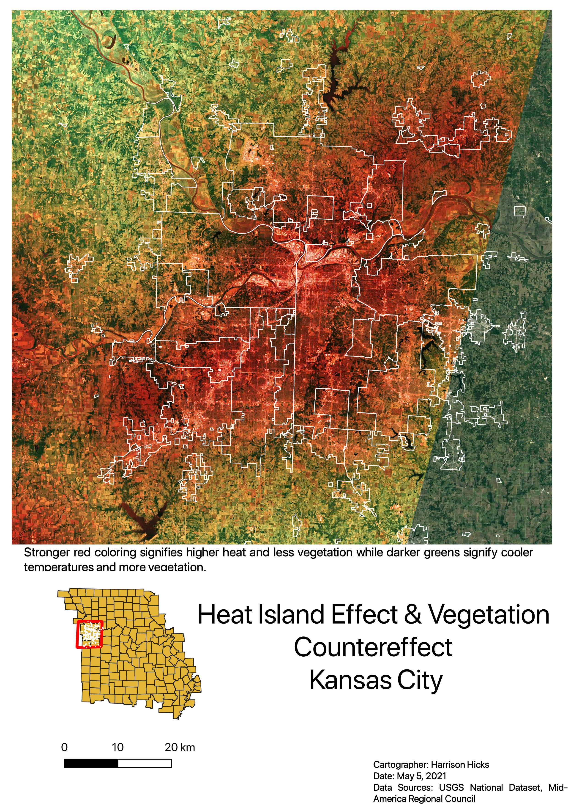

This project includes four images providing different ways to interpret the heat island effect in Kansas City.

This first image shows a base LANDSAT image of Kansas City that allows us to get familiar with the space.

Secondly, this image show the heat island effect in two different ways. The darker reds in each image signify higher temperatures.

This image helps to show vegetation density within Kansas City. The two view allow us to see green space from two different viewpoints.

Lastly, this rendered map shows a combination of vegetation areas and the heat island effect. This map blends two of the previous images to give a new rendered LANDSAT image.

